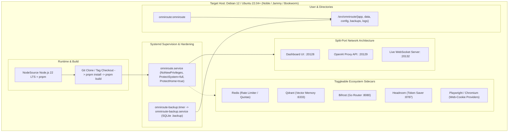

# Implementation Plan: Comprehensive OmniRoute Ansible Role

## Goal Description
Create a comprehensive, fully-featured, production-ready, and all-config-options standalone Ansible role for **[OmniRoute](https://github.com/diegosouzapw/OmniRoute)** (`ansible-role-omniroute`), aligning with the repository standard established in `ansible-role-postgresql`, `ansible-role-authentik`, and `ansible-role-openclaw-agent`.

The role automates the deployment of OmniRoute as a hardened native host `systemd` service running on Node.js 22 LTS with pnpm, supporting split-port network architecture, real-time WebSocket monitoring, automated online SQLite backups with retention pruning, optional sidecar integrations (Redis rate-limiter, Qdrant vector memory, Bifrost Go router, Headroom token compressor, and Playwright for web-cookie providers), and comprehensive variable mapping for all 100+ OmniRoute environment variables and configuration policies.



---

## User Decisions & Confirmed Architecture

1. **Deployment Architecture**:
   - Native host execution managed by `systemd`.
   - Engine: NodeSource repository installing Node.js 22 LTS with `corepack enable` and `pnpm`.
   - Deployment process: Git clone of release tag (or specific commit/branch) into `/srv/omniroute/app`, followed by `pnpm install` and `pnpm build`.

2. **Network & Port Architecture**:
   - **Split-port mode** enabled:
     - Dashboard Web UI: `DASHBOARD_PORT=20128` (Bind: `0.0.0.0`)
     - AI Proxy API (`/v1`, `/v1beta`, `/a2a`): `API_PORT=20129` (Bind: `0.0.0.0`)
     - Live Dashboard WebSocket Server: `LIVE_WS_PORT=20132` (Bind: `0.0.0.0` or configurable host with origins)
   - Full reverse proxy support (Forwarded headers, basePath, CORS, WebSocket origin allowlists).

3. **Security & Secrets Management**:
   - **Idempotent auto-generation**: If secrets (`JWT_SECRET`, `API_KEY_SECRET`, `OMNIROUTE_WS_BRIDGE_SECRET`, `INITIAL_PASSWORD`, `STORAGE_ENCRYPTION_KEY`) are left blank in Ansible variables, the role automatically generates cryptographically strong secrets on the first run and persists them securely into `/srv/omniroute/config/.secrets.env` (chmod 0600, owned by `omniroute:omniroute`).
   - Supports explicit overrides via Ansible Vault.

4. **Directory Structure & User**:
   - Dedicated system user/group: `omniroute:omniroute`.
   - Base Home: `/srv/omniroute`
     - `/srv/omniroute/app` (Application source and built dist)
     - `/srv/omniroute/data` (SQLite database with WAL mode and runtime state)
     - `/srv/omniroute/config` (`.env`, `payloadRules.json`, `.secrets.env`)
     - `/srv/omniroute/backups` (Scheduled SQLite backup files with retention rotation)
     - `/var/log/omniroute` (Service logs)

5. **Backup Strategy**:
   - Dedicated `omniroute-backup.sh` utilizing SQLite online vacuum/backup (`sqlite3 /srv/omniroute/data/omniroute.db ".backup '/srv/omniroute/backups/omniroute_backup_YYYYMMDD_HHMMSS.db'"`).
   - Automated via `omniroute-backup.timer` (Daily at 02:00 by default) with configurable retention pruning (e.g. 7 days).

6. **Systemd Hardening**:
   - Production-hardened systemd unit:
     - `NoNewPrivileges=true`
     - `ProtectSystem=full`
     - `ProtectHome=true`
     - `PrivateTmp=true`
     - `RestrictSUIDSGID=true`
     - `ProtectKernelTunables=true`
     - `ProtectControlGroups=true`
     - `Restart=always` & `RestartSec=5s`
     - `TimeoutStopSec=40s`

7. **Sidecar Integrations (Toggleable)**:
   - **Redis**: Toggleable (`omniroute_redis_enabled`). Supports local system service or external URL for distributed rate-limiting and quota tracking.
   - **Qdrant**: Toggleable (`omniroute_qdrant_enabled`) for semantic vector memory offload on port 6333.
   - **Bifrost**: Toggleable (`omniroute_bifrost_enabled`) for Tier-1 Go router on port 8080.
   - **Headroom**: Toggleable (`omniroute_headroom_enabled`) for token compression proxy on port 8787.
   - **Playwright / Chromium**: Toggleable (`omniroute_enable_playwright`) installing system browser dependencies for web-cookie providers (`gemini-web`, `claude-web`, `claude-turnstile`).

---

## Proposed File & Component Structure

### Repository Files
```
ansible-role-omniroute/
├── .ansible-lint
├── .yamllint
├── .gitignore
├── ansible.cfg
├── meta/
│   └── main.yml
├── inventory/
│   └── hosts.yml
├── playbooks/
│   └── site.yml
├── README.md
├── AGENTS.md
├── PLAN.md
└── roles/
    └── omniroute/
        ├── defaults/
        │   └── main.yml              # Exhaustive variable defaults with inline docs
        ├── vars/
        │   ├── main.yml
        │   ├── debian.yml
        │   └── ubuntu.yml
        ├── handlers/
        │   └── main.yml              # restart omniroute, reload systemd, restart backup timer
        ├── tasks/
        │   ├── main.yml              # Entrypoint & OS compatibility checks
        │   ├── prerequisites.yml     # OS packages: git, curl, build-essential, sqlite3, python3
        │   ├── user.yml              # System user, group & directory creation
        │   ├── nodejs.yml            # NodeSource repo setup, Node.js 22, corepack, pnpm
        │   ├── secrets.yml           # Crypto secret generation & persistence
        │   ├── install.yml           # Git clone, pnpm install --frozen-lockfile, pnpm build
        │   ├── playwright.yml        # Optional Playwright/Chromium dependencies
        │   ├── config.yml            # .env & payloadRules.json rendering
        │   ├── sidecars.yml          # Redis/Qdrant/Bifrost/Headroom sidecar configuration
        │   ├── service.yml           # Systemd unit installation & service lifecycle
        │   ├── backup.yml            # Backup script, systemd service & timer
        │   └── validate.yml          # Health checks & API probe
        └── templates/
            ├── env.j2                # Full .env template covering all OmniRoute features
            ├── payloadRules.json.j2  # Custom payload manipulation rules template
            ├── omniroute.service.j2  # Hardened systemd service unit
            ├── omniroute-backup.sh.j2
            ├── omniroute-backup.service.j2
            └── omniroute-backup.timer.j2
```

---

## Exhaustive Configuration Options (`defaults/main.yml`)

The role will provide exhaustive configuration variables grouped into clear logical sections:

1. **Service & Installation Basics**:
   - `omniroute_version: "main"` (or release tag like `"v3.8.51"`)
   - `omniroute_repo_url: "https://github.com/diegosouzapw/OmniRoute.git"`
   - `omniroute_user: "omniroute"`, `omniroute_group: "omniroute"`
   - `omniroute_home: "/srv/omniroute"`
   - `omniroute_app_dir: "/srv/omniroute/app"`
   - `omniroute_data_dir: "/srv/omniroute/data"`
   - `omniroute_config_dir: "/srv/omniroute/config"`
   - `omniroute_backup_dir: "/srv/omniroute/backups"`
   - `omniroute_log_dir: "/var/log/omniroute"`

2. **Node.js & Build Options**:
   - `omniroute_manage_nodejs: true`
   - `omniroute_nodejs_version: "22"`
   - `omniroute_pnpm_version: "latest"`
   - `omniroute_node_options: "--max-old-space-size=2048"`
   - `omniroute_force_rebuild: false`

3. **Security & Secrets**:
   - `omniroute_jwt_secret: ""` (auto-generated if empty)
   - `omniroute_api_key_secret: ""` (auto-generated if empty)
   - `omniroute_initial_password: ""` (auto-generated if empty)
   - `omniroute_storage_encryption_key: ""` (optional)
   - `omniroute_storage_encryption_key_version: "v1"`
   - `omniroute_ws_bridge_secret: ""` (auto-generated if empty)
   - `omniroute_machine_id_salt: "endpoint-proxy-salt"`
   - `omniroute_cli_salt: "omniroute-cli-auth-v1"`
   - `omniroute_require_api_key: false`
   - `omniroute_allow_api_key_reveal: false`
   - `omniroute_auth_cookie_secure: false`
   - `omniroute_no_log_api_key_ids: []`
   - `omniroute_default_rate_limit_per_day: 0`

4. **Network, Ports & WebSocket**:
   - `omniroute_port_mode: "split"`
   - `omniroute_port: 20128`
   - `omniroute_dashboard_port: 20128`
   - `omniroute_api_port: 20129`
   - `omniroute_api_host: "0.0.0.0"`
   - `omniroute_server_host: "0.0.0.0"`
   - `omniroute_base_path: ""`
   - `omniroute_public_base_url: "http://localhost:20128"`
   - `omniroute_live_ws_enabled: true`
   - `omniroute_live_ws_port: 20132`
   - `omniroute_live_ws_host: "0.0.0.0"`
   - `omniroute_live_ws_allowed_origins: ["http://localhost:20128", "http://127.0.0.1:20128"]`
   - `omniroute_live_ws_allowed_hosts: []`
   - `omniroute_live_ws_public_url: ""`
   - `omniroute_dashboard_allow_embed: ""`
   - `omniroute_trust_proxy: ""`
   - `omniroute_cors_allowed_origins: []`
   - `omniroute_cors_allow_all: false`

5. **Sanitization, Guardrails & SSRF**:
   - `omniroute_input_sanitizer_enabled: true`
   - `omniroute_input_sanitizer_mode: "warn"`
   - `omniroute_input_sanitizer_block_threshold: "high"`
   - `omniroute_pii_redaction_enabled: false`
   - `omniroute_credential_redaction_enabled: false`
   - `omniroute_pii_window_size: 200`
   - `omniroute_pii_response_sanitization: false`
   - `omniroute_pii_response_sanitization_mode: "redact"`
   - `omniroute_vscode_sanitize_context: true`
   - `omniroute_allow_private_provider_urls: true`
   - `omniroute_allow_local_provider_urls: true`
   - `omniroute_outbound_ssrf_guard_enabled: true`

6. **Memory, Backpressure & Admission Gate**:
   - `omniroute_chat_large_body_bytes: 262144`
   - `omniroute_chat_hard_max_body_bytes: 52428800`
   - `omniroute_chat_max_heavy_in_flight: 1`
   - `omniroute_chat_admission_heap_shed_ratio: 0.75`
   - `omniroute_chat_admission_healthy_headroom: 1`
   - `omniroute_chat_heavy_message_count: 200`
   - `omniroute_chat_heavy_tool_count: 64`
   - `omniroute_chat_heavy_estimated_tokens: 32000`
   - `omniroute_chat_hard_max_messages: 0`
   - `omniroute_chat_admission_queue_ms: 2000`
   - `omniroute_chat_admission_max_queued_bytes: 4194304`
   - `omniroute_chat_virtual_lanes: 0`
   - `omniroute_max_body_size_bytes: 10485760`
   - `omniroute_max_nonstreaming_response_bytes: 67108864`
   - `omniroute_combo_concurrency_per_model: 3`

7. **Outbound Proxy & Egress Controls**:
   - `omniroute_enable_socks5_proxy: true`
   - `omniroute_http_proxy: ""`
   - `omniroute_https_proxy: ""`
   - `omniroute_all_proxy: ""`
   - `omniroute_no_proxy: "localhost,127.0.0.1"`
   - `omniroute_proxy_echo_url: ""`
   - `omniroute_proxy_dispatcher_connections: 32`
   - `omniroute_socks_handshake_timeout_ms: 10000`
   - `omniroute_proxy_fail_open: false`
   - `omniroute_enable_tls_fingerprint: false`
   - `omniroute_tls_fingerprint_providers: []`

8. **Tool Policies & MCP Server**:
   - `omniroute_tool_policy_mode: "disabled"`
   - `omniroute_mcp_enforce_scopes: false`
   - `omniroute_mcp_scopes: ["admin", "combos", "health"]`
   - `omniroute_mcp_compress_descriptions: true`
   - `omniroute_mcp_description_compression: "rtk"`
   - `omniroute_mcp_fetch_timeout_ms: 10000`
   - `omniroute_mcp_upstream_timeout_ms: 60000`
   - `omniroute_payload_rules: {}`

9. **Sidecars & Advanced Integrations**:
   - `omniroute_redis_enabled: false`
   - `omniroute_redis_url: "redis://127.0.0.1:6379"`
   - `omniroute_redis_key_prefix: "omniroute:"`
   - `omniroute_qdrant_enabled: false`
   - `omniroute_qdrant_url: "http://127.0.0.1:6333"`
   - `omniroute_bifrost_enabled: false`
   - `omniroute_bifrost_url: "http://127.0.0.1:8080"`
   - `omniroute_headroom_enabled: false`
   - `omniroute_headroom_url: "http://127.0.0.1:8787"`
   - `omniroute_enable_playwright: false`

10. **Database & Backup Automation**:
    - `omniroute_disable_sqlite_auto_backup: false`
    - `omniroute_skip_db_healthcheck: false`
    - `omniroute_backup_cron_enabled: true`
    - `omniroute_backup_schedule: "*-*-* 02:00:00"`
    - `omniroute_backup_retention_days: 7`

---

## Verification Plan

### Automated Tests
1. **Linting Verification**:
   ```bash
   ansible-lint
   yamllint .
   ```
2. **Syntax Validation**:
   ```bash
   ansible-playbook -i inventory/hosts.yml playbooks/site.yml --syntax-check
   ```
3. **Template Rendering**:
   Verify Jinja2 syntax across `env.j2`, `omniroute.service.j2`, and backup templates.

### Operational Verification
1. Check that secrets are generated and persisted into `.secrets.env`.
2. Check that the systemd unit starts cleanly with split ports (:20128 and :20129) and WebSocket (:20132).
3. Validate `/api/monitoring/health` and `/v1/models` endpoints.
